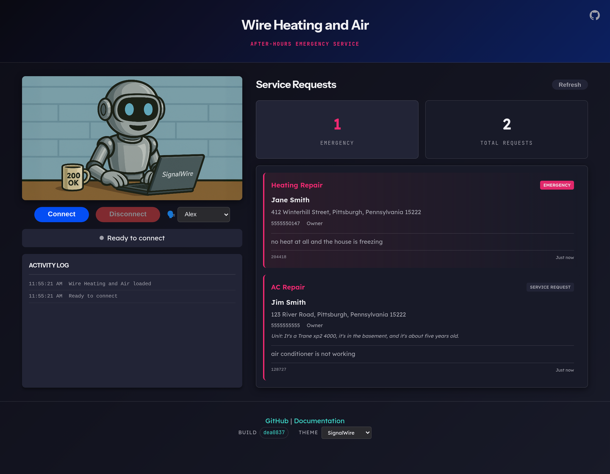

# Wire Heating and Air

An after-hours emergency HVAC service agent built with SignalWire AI. Customers call to report heating and air conditioning emergencies, while staff view service requests through a real-time web dashboard.

```
┌─────────────────────────────────────────────────────────────────────────────┐
│                                                                             │
│    Customer calls  ───►  AI Agent  ───►  Service Request Created            │
│                                                                             │
│                              │                                              │
│                              ▼                                              │
│                       Web Dashboard                                         │
│                    (real-time updates)                                      │
│                                                                             │
└─────────────────────────────────────────────────────────────────────────────┘
```



*The dashboard in the SignalWire theme, with one request of each tier: an
emergency the caller confirmed, and a routine visit that collected unit details
and ownership. Switch themes from the footer; the build hash beside it is the
commit actually running.*

## Features

- **After-Hours Service** - 24/7 emergency call handling for HVAC issues
- **Emergency Classification** - Two-tier urgency: emergency vs non-emergency
- **Complete Data Collection** - Name, address, unit info, ownership, callback numbers
- **Real-time Dashboard** - Live updates when service requests are submitted
- **Multi-context AI** - Guided conversation prevents errors
- **In-memory Storage** - Simple deployment, no database required

## Architecture

```
┌─────────────────────────────────────────────────────────────────────────┐
│                              SIGNALWIRE                                 │
│  ┌─────────────┐         ┌─────────────┐         ┌─────────────┐        │
│  │   Phone     │         │   WebRTC    │         │    SWML     │        │
│  │   Network   │────────►│   Gateway   │────────►│   Handler   │        │
│  └─────────────┘         └─────────────┘         └──────┬──────┘        │
└─────────────────────────────────────────────────────────┼───────────────┘
                                                          │
                                                          ▼
┌─────────────────────────────────────────────────────────────────────────┐
│                      WIRE HEATING AND AIR SERVER                        │
│                                                                         │
│  ┌────────────────────────────────────────────────────────────────────┐ │
│  │                      AfterHoursAgent                               │ │
│  │  ┌──────────┐    ┌───────────┐    ┌──────────┐                     │ │
│  │  │ Greeting │───►│  Service  │───►│ Confirm  │                     │ │
│  │  │ Context  │    │  Request  │    │ Context  │                     │ │
│  │  └──────────┘    │  Context  │    └──────────┘                     │ │
│  │                  └───────────┘                                     │ │
│  └────────────────────────────────────────────────────────────────────┘ │
│                                    │                                    │
│                                    ▼                                    │
│  ┌─────────────────────────────────────────────────────────────────┐    │
│  │                     SERVICE_REQUESTS (dict)                     │    │
│  └─────────────────────────────────────────────────────────────────┘    │
│                                    │                                    │
│                                    ▼                                    │
│                            API Routes                                   │
│                         /api/requests                                   │
│                         /api/config                                     │
└─────────────────────────────────────────────────────────────────────────┘
                                     │
                                     ▼
┌─────────────────────────────────────────────────────────────────────────┐
│                           WEB DASHBOARD                                 │
│  ┌──────────────────────────────────────────────────────────────────┐   │
│  │  ┌─────────┐  ┌───────────────────────────────────────────────┐  │   │
│  │  │  Video  │  │           Service Requests                    │  │   │
│  │  │  Call   │  │  ┌──────────────────────────────────────────┐ │  │   │
│  │  │         │  │  │ [EMERGENCY] AC Repair                    │ │  │   │
│  │  ├─────────┤  │  │  Jim Smith - 123 River Road                │ │  │   │
│  │  │ Connect │  │  │  AC not working, house at 95 degrees     │ │  │   │
│  │  └─────────┘  │  └──────────────────────────────────────────┘ │  │   │
│  │               │  ┌──────────────────────────────────────────┐ │  │   │
│  │  Activity Log │  │ Heating Repair                           │ │  │   │
│  │  ───────────  │  │  Jane Doe - 456 Oak Ave                  │ │  │   │
│  │  Connected... │  │  Furnace making noise                    │ │  │   │
│  │  New request..│  └──────────────────────────────────────────┘ │  │   │
│  └──────────────────────────────────────────────────────────────────┘   │
└─────────────────────────────────────────────────────────────────────────┘
```

## Conversation Flow

The caller is routed into one of two intakes, and **the caller decides which**.
An emergency pages the on-call technician overnight, so it is not inferred from
the problem description.

```
                        ┌──────────────────────────────┐
                        │  GREETING (static)           │
                        │  "...How can I help you      │
                        │   today?"                    │
                        └──────────────┬───────────────┘
                                       ▼
                        ┌──────────────────────────────┐
                        │  TRIAGE  (assess_urgency)    │
                        │                              │
                        │  Acknowledge the problem in  │
                        │  their words, say what you   │
                        │  think, then ASK:            │
                        │  "treat it as an emergency,  │
                        │   or can it wait for normal  │
                        │   business hours?"           │
                        │                              │
                        │  set_urgency() also banks    │
                        │  issue_type and the caller's │
                        │  own issue_description.      │
                        └───────┬──────────────┬───────┘
                   emergency    │              │   routine
                                ▼              ▼
              ┌───────────────────────┐  ┌───────────────────────┐
              │ EMERGENCY_INTAKE      │  │ SERVICE_REQUEST       │
              │ collect (gather_info) │  │ collect (gather_info) │
              │                       │  │                       │
              │ 1. customer_name      │  │ 1. customer_name      │
              │ 2. service_address ✓  │  │ 2. service_address ✓  │
              │ 3. callback_primary ✓ │  │ 3. unit_info          │
              │                       │  │ 4. ownership          │
              │ unit/ownership are    │  │ 5. callback_primary ✓ │
              │ deferred to the       │  │                       │
              │ callback, to page a   │  │ ✓ = read back and     │
              │ technician sooner.    │  │     confirmed         │
              └───────────┬───────────┘  └───────────┬───────────┘
                          │                          │
                          ▼                          ▼
              ┌──────────────────────────────────────────────────┐
              │  review  →  confirm_request()                    │
              │  Reads back name, address and the problem in     │
              │  their words, then submits. Rejects a ticket     │
              │  whose address is the caller's name, or has no   │
              │  street number.                                  │
              └───────────────────────┬──────────────────────────┘
                                      ▼
              ┌──────────────────────────────────────────────────┐
              │  GREETING (welcome)                              │
              │  Ticket number read twice, "anything else?",     │
              │  then end_call() hangs up.                       │
              └──────────────────────────────────────────────────┘
```

A gas smell short-circuits all of this: it is recorded immediately without
asking whether it is urgent, and the caller is told to leave the building and
call nine one one from outside.

## Data Collected

Where a field comes from matters as much as what it is: anything the caller
already said is taken from what they said, not asked again.

| Field | Source | Example |
|-------|--------|---------|
| Issue Type | banked by `set_urgency` at triage | `ac_repair` |
| Issue Description | banked at triage, in the caller's own words | `air conditioner is not working` |
| Is Emergency | **asked and confirmed by the caller** | `false` |
| Gas Smell | only if the caller mentions gas | `false` |
| Customer Name | gather | `Jim Smith` |
| Service Address | gather, read back and confirmed | `123 River Road, Pittsburgh, Pennsylvania 15222` |
| Unit Info | gather, routine intake only | `Trane xp2 4000, basement, about five years old` |
| Ownership | gather, routine intake only | `own` |
| Callback Primary | gather, read back and confirmed | `5555555555` |
| Callback Alternate | optional | |

Two fields are deliberately absent from the gather. `issue_type` and
`issue_description` are captured during triage, because the caller has already
described the problem by the time urgency is settled - asking again produced
"I already told you" on a real call.

Spoken digits are folded back into numerals before a ticket is written, so a
caller reading out "one five two two two" is filed as `15222` rather than as
the words.

## Agent Design

### SWAIG functions

Five, deliberately. Every field the gather can collect was once a `set_` function
of its own; eleven tools degraded the model's choice badly enough that it called
the wrong one, so collection moved into `gather_info` and the tools shrank to the
decisions.

| Function | Does |
|---|---|
| `start_service_request` | enter triage from the greeting |
| `set_urgency` | record emergency/routine, and bank `issue_type` + `issue_description` |
| `confirm_request` | validate, write the ticket, push it to the dashboard |
| `end_call` | say goodbye and hang up |
| `cancel_flow` | abandon and return to the greeting |

### The emergency gate

`set_urgency` requires `confirmed_by_caller`, and the handler **refuses** an
emergency without it, returning an instruction to go and ask. This is enforced
in the schema rather than the prompt because the prompt already asked for it and
the model skipped it: on one call "my air conditioner is not working" became
`is_emergency: true` with nobody consulted, which pages a technician overnight.

Gas is the one exception - you do not ask someone who smells gas whether it is
urgent.

### Turn-taking

These are not defaults, and each one was found by a call that went wrong.

| Setting | Value | Why |
|---|---|---|
| `enable_barge` | `True` | Without it the caller cannot interrupt. One call logged **one** `speech_detect` in 152 seconds while 7571 packets of their audio arrived: the agent's own prompting was deafening it. |
| `attention_timeout` | `30000` | 15s was too aggressive for an after-hours line - someone at their furnace is not an absent caller. |
| `attention_timeout_prompt` | set | Without it the platform **replays the full greeting** on every timeout, which sounds like the line reset. One call played it three times. |
| `static_greeting` | set | With `wait_for_user: False`, or the call stalls. |
| `initial_sleep_ms` | `2000` | Measured 1715ms to audible; speaking earlier loses the opening words. |
| model override | **none** | A pinned `gpt-oss-120b` produced 108 `reasoning_only_retry` events and 240 LLM round trips in one call, and spoke a retry filler aloud. On the platform default the same flow takes ~20. |

### Prompt sections

`Use Their Words` is the one that shapes how the agent sounds: acknowledge the
problem in the caller's own terms before asking anything, name the stake briefly
(no heat means cold), then move on. The acknowledgement rides on the **first
gather question**, because a function's response text and a step's `set_text` are
both discarded when `swml_change_context` hands over to a gather - the gather
takes the turn immediately.

## Quick Start

### Prerequisites

- Python 3.11+
- SignalWire account ([sign up free](https://signalwire.com))

### Installation

```bash
# Clone the repository
git clone https://github.com/signalwire-demos/afterhours.git
cd afterhours

# Create virtual environment
python -m venv venv
source venv/bin/activate  # On Windows: venv\Scripts\activate

# Install dependencies
pip install -r requirements.txt

# Configure environment
cp .env.example .env
# Edit .env with your SignalWire credentials
```

### Configuration

Edit `.env` with your settings:

```bash
# Required - SignalWire credentials
SIGNALWIRE_SPACE_NAME=your-space
SIGNALWIRE_PROJECT_ID=your-project-id
SIGNALWIRE_TOKEN=your-api-token

# Required for local dev - use ngrok or similar
SWML_PROXY_URL_BASE=https://your-ngrok-url.ngrok.io

# Optional - display phone number on website
PHONE_NUMBER=+1-555-123-4567

# Optional - post-call summary webhook
POST_PROMPT_URL=https://your-webhook.com/summary
```

### Running

```bash
# Local development
python app.py

# Production (via Procfile)
gunicorn app:app --bind 0.0.0.0:$PORT --workers 2 --worker-class uvicorn.workers.UvicornWorker
```

Open http://localhost:5000 to view the dashboard.

## API Endpoints

| Endpoint | Method | Description |
|----------|--------|-------------|
| `/api/config` | GET | Returns company name and phone number |
| `/api/requests` | GET | All service requests |
| `/api/requests/{id}` | GET | Single service request details |
| `/get_token` | GET | WebRTC authentication token |
| `/health` | GET | Health check |
| `/afterhours` | POST | SWML webhook (called by SignalWire) |

### Example: Get Service Requests

```bash
curl http://localhost:5000/api/requests
```

```json
{
  "requests": [
    {
      "id": "128727",
      "customer_name": "Jim Smith",
      "service_address": "123 River Road, Pittsburgh, Pennsylvania 15222",
      "unit_info": "It's a Trane xp2 4000, it's in the basement, and it's about five years old.",
      "ownership": "Own",
      "callback_primary": "5555555555",
      "callback_alternate": "",
      "issue_type": "ac_repair",
      "is_emergency": false,
      "gas_smell": false,
      "issue_description": "air conditioner is not working",
      "created_at": "2026-10-06T15:28:05.346142",
      "status": "pending"
    }
  ],
  "emergency_count": 0,
  "total_count": 1
}
```

## Data Model

```
┌─────────────────────────────────────────────────────────────────┐
│                      SERVICE REQUEST                            │
├─────────────────────────────────────────────────────────────────┤
│  id                   string      "128727"   (6 digits, spoken) │
│  customer_name        string      "Jim Smith"                   │
│  service_address      string      "123 River Road, ... 15222"   │
│  unit_info            string      "Trane xp2 4000, basement"    │
│  ownership            string      "own" | "rent" | "unknown"    │
│  callback_primary     string      "5555555555"                  │
│  callback_alternate   string      ""                            │
│  issue_type           string      "ac_repair" | "heating_repair"│
│  is_emergency         boolean     true | false                  │
│  gas_smell            boolean     true | false                  │
│  issue_description    string      "air conditioner is not ..."  │
│  created_at           string      "2026-10-06T15:28:05Z"        │
│  status               string      "pending" | "dispatched"      │
└─────────────────────────────────────────────────────────────────┘
```

The id is read back to the caller twice, digit by digit, so it is short and
numeric rather than a uuid.

## Tech Stack

- **Backend**: Python, FastAPI, SignalWire Agents SDK
- **Frontend**: Vanilla JavaScript, SignalWire WebRTC SDK
- **AI**: SignalWire AI with multi-context SWML
- **Deployment**: Dokku/Heroku compatible

## Project Structure

```
afterhours/
├── app.py                      # Agent, SWAIG functions, server, ticket store
├── web/
│   ├── index.html              # Dashboard UI (theme picker, build footer)
│   ├── app.js                  # Frontend logic
│   ├── styles.css              # Styling
│   ├── elevenlabs_voices.json  # Voice pickers
│   ├── inworld_voices.json
│   ├── afterhours.png          # Branding
│   └── sigmond_pc*.png|mp4     # Avatar stills and loops
├── .github/workflows/          # deploy.yml, preview.yml
├── .dokku/                     # config.yml, services.yml
├── Dockerfile                  # Container build (runs as appuser)
├── .dockerignore
├── .env.example                # Environment template
├── Procfile                    # Production server config
├── app.json                    # Deployment manifest
├── requirements.txt            # Python dependencies
├── CLAUDE.md                   # Working notes for this demo
└── README.md
```

## Deployment

The app is configured for Dokku/Heroku deployment:

1. Set environment variables on your platform
2. Push to deploy
3. The app auto-registers its SWML handler with SignalWire on startup

For local development with phone calls, use [ngrok](https://ngrok.com) to expose your local server:

```bash
ngrok http 5000
# Set SWML_PROXY_URL_BASE to the ngrok URL
```

## License

MIT
